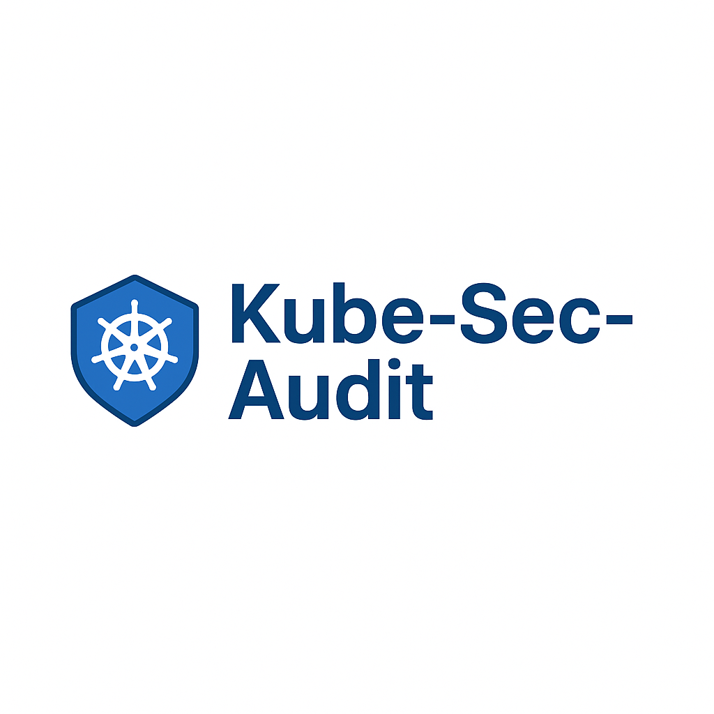

# Kube-Sec-Audit

  

Comprehensive Kubernetes security auditing tool that detects misconfigurations, vulnerabilities, and risks across your cluster using multiple integrated modules.

## Features

- **RBAC Analyzer:** Detects overprivileged roles and bindings  
- **Pod Security Analyzer:** Checks pod security contexts for risky configurations  
- **NetworkPolicy Analyzer:** Identifies missing or overly permissive network policies  
- **Image & Tag Scanner:** Detects use of `latest` tags and outdated images  
- **Privileged Pod Detector:** Finds pods with privileged access, host networking, or hostPath mounts  
- **Secret Detector:** Finds exposed secrets in cluster resources  
- **Modular design:** Unified JSON reporting for all checks

## Installation

| Step | Command                                      |
|-------|---------------------------------------------|
| Clone | `git clone https://github.com/yourusername/kube-sec-audit.git` |
| Enter | `cd kube-sec-audit`                         |
| Build | `go build -o kube-sec-audit cmd/main.go`    |

## Usage

| Example                                   | Description                  |
|-------------------------------------------|------------------------------|
| `./kube-sec-audit -k ~/.kube/config -m all -o report.json` | Run all modules and save report |
| `./kube-sec-audit -k ~/.kube/config -m rbac,podsec,imagecheck -o partial-report.json` | Run selected modules only     |

## CLI Flags

| Flag | Description                             | Required | Default      |
|-------|-------------------------------------|----------|--------------|
| `-k`  | Path to kubeconfig file              | Yes      | —            |
| `-m`  | Modules to run (comma separated)    | No       | all          |
| `-o`  | Output report file path (JSON)      | No       | report.json  |

## Available Modules

| Module        | Description                                   |
|---------------|-----------------------------------------------|
| `rbac`        | Analyze RBAC roles and bindings               |
| `podsec`      | Analyze Pod security contexts                  |
| `netpol`      | Analyze NetworkPolicies                         |
| `imagecheck`  | Scan container images and tags                  |
| `privilege`   | Detect privileged pods and risky host access   |
| `secrets`     | Detect exposed secrets                           |
| `kubeaudit`   | Additional Kubernetes audit checks              |
| `imagescanner`| Scan images for vulnerabilities (planned)      |

## Contributing

Contributions are welcome! Feel free to open issues or submit pull requests.

## License

MIT License
